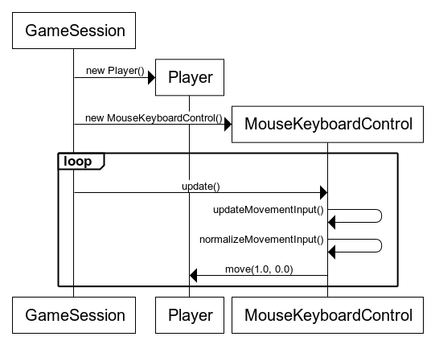

# Arkkitehtuuri

## Pakkausrakenne

## Käyttöliittymä

Sovelluksen käyttöliittymä on rakennettu JavaFX-kirjaston avulla. Sovelluksen ikkunaa kuvaa JavaFX:n Stage-olio, jonka Scene-oliota vaihdetaan eri näkymien välillä liikkumiseksi. Käyttöliittymä sisältää seuraavat näkymät:
- Päävalikko
- Pistetaulukko
- "New Game"-näkymä
- Pelinäkymä

SpaceShooterUi-luokka rakentaa näkymät ohjelmallisesti suoritusaikana.

## Sovelluslogiikka

Sovelluksen luokkien yhteyksiä kuvaava luokkakaavio:

SpaceShooterUi luo uuden GameSession-olion ja asettaa AnimationTimer-olion kutsumaan sen update-metodia toistuvasti, kun pelaaja on klikannut "Start"-nappia. GameSession huolehtii pelin tilan päivittämisestä kutsumalla omasta update-metodistaan muiden olioiden update-metodeja. Täten kaikkien pelissä olevien aktiivisten olioiden update-metodeja kutsutaan kerran yhden update-syklin aikana.

### Sekvenssikaaviot

Pelaajan liikuttamista kuvaava sekvenssikaavio:

